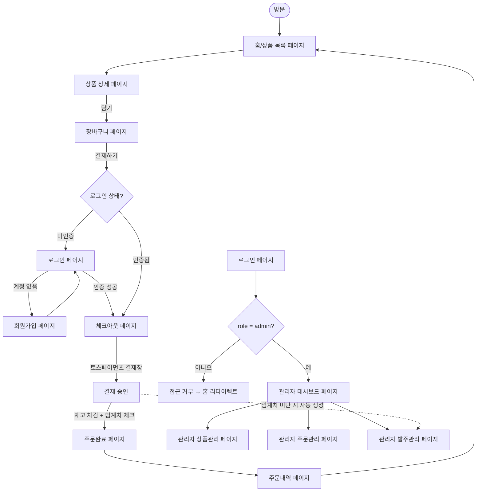

# PRD: 재고 부족 자동 재주문 커머셜 웹 MVP

## 1. 프로젝트 핵심

- **목적**: 상품 재고가 설정된 임계치 이하로 떨어지면 시스템이 자동으로 발주 요청을 생성해, 관리자가 재고 소진을 놓치지 않고 대시보드에서 확인·입고 처리할 수 있는 B2C 온라인 쇼핑몰
- **타겟 사용자**: 재고 관리 인력 없이 1~2인이 직접 운영하는 소규모 온라인 셀러(관리자)와, 해당 쇼핑몰에서 상품을 구매하는 일반 소비자(고객)

## 2. 사용자 여정

- 결제 완료 시점(서버 콜백)에 재고 차감과 임계치 체크가 하나의 트랜잭션으로 처리되며, 임계치 미만이면 고객에게는 노출되지 않고 관리자 발주관리 페이지에만 발주 요청이 나타난다.
- 미인증 사용자가 체크아웃에 진입하려 하면 로그인 페이지로 리다이렉트되고, 로그인 성공 후 체크아웃으로 복귀한다.
- 관리자가 아닌 사용자가 관리자 라우트에 접근하면 홈으로 리다이렉트된다(관리자 대시보드 페이지 진입 조건 참고).
- 분기점: 로그인 여부(체크아웃 진입), role 여부(관리자 라우트 진입), 재고 임계치 도달 여부(발주 자동 생성).

## 3. 기능 명세 (MVP 중심)

| 기능 ID | 기능명                 | 설명                                                        | 관련 페이지                                                                                    |
| ------- | ---------------------- | ----------------------------------------------------------- | ---------------------------------------------------------------------------------------------- |
| F001    | 회원가입               | 이메일/비밀번호로 계정 생성                                 | 회원가입 페이지                                                                                |
| F002    | 로그인                 | 이메일/비밀번호로 인증, 세션 발급                           | 로그인 페이지                                                                                  |
| F003    | 상품 목록 조회         | 판매 중인 상품을 목록으로 표시                              | 홈/상품 목록 페이지                                                                            |
| F004    | 상품 상세 조회         | 개별 상품의 상세 정보(가격, 재고 여부, 설명) 표시           | 상품 상세 페이지                                                                               |
| F005    | 장바구니 관리          | 상품 담기, 수량 조정, 삭제                                  | 상품 상세 페이지, 장바구니 페이지                                                              |
| F006    | 배송정보 입력          | 수령인/주소/연락처 입력                                     | 체크아웃 페이지                                                                                |
| F007    | 토스페이먼츠 결제 요청 | 결제창 호출 및 결제 수단 선택                               | 체크아웃 페이지                                                                                |
| F008    | 결제 승인 및 주문 생성 | 결제 승인 콜백에서 주문·주문상품 생성, 재고 차감(트랜잭션)  | 주문완료 페이지                                                                                |
| F009    | 자동 발주 요청 생성    | 재고 차감 후 임계치 미만이면 발주 요청 자동 생성(중복 방지) | 관리자 발주관리 페이지                                                                         |
| F010    | 주문완료 확인          | 결제 완료 결과 및 주문 요약 표시                            | 주문완료 페이지                                                                                |
| F011    | 주문내역 조회          | 본인의 과거 주문 목록/상태 확인                             | 주문내역 페이지                                                                                |
| F020    | 관리자 권한 체크       | `profiles.role = 'admin'` 검증, 아니면 접근 차단            | 관리자 대시보드 페이지, 관리자 상품관리 페이지, 관리자 주문관리 페이지, 관리자 발주관리 페이지 |
| F021    | 대시보드 요약          | 매출/주문 건수/재고부족 상품 현황 요약                      | 관리자 대시보드 페이지                                                                         |
| F022    | 상품 등록              | 신규 상품 및 초기 재고·임계치 입력                          | 관리자 상품관리 페이지                                                                         |
| F023    | 상품 수정/삭제         | 기존 상품 정보, 재고, 임계치 수정 및 삭제                   | 관리자 상품관리 페이지                                                                         |
| F024    | 주문 관리              | 전체 주문 목록/상세 조회 및 배송 상태 변경                  | 관리자 주문관리 페이지                                                                         |
| F025    | 발주 요청 목록 조회    | 자동 생성된 발주 요청을 상태별로 조회                       | 관리자 발주관리 페이지                                                                         |
| F026    | 발주 확인 처리         | 발주 요청을 pending → confirmed로 전환                      | 관리자 발주관리 페이지                                                                         |
| F027    | 입고 처리              | confirmed → received 전환 시 재고 수량 반영                 | 관리자 발주관리 페이지                                                                         |

## 4. 메뉴 구조

### 헤더 메뉴 (공통)

| 메뉴명       | 기능 ID |
| ------------ | ------- |
| 홈/상품 목록 | F003    |

### 사용자별 메뉴 — 비로그인

| 메뉴명   | 기능 ID |
| -------- | ------- |
| 로그인   | F002    |
| 회원가입 | F001    |

### 사용자별 메뉴 — 로그인(customer)

| 메뉴명   | 기능 ID |
| -------- | ------- |
| 장바구니 | F005    |
| 주문내역 | F011    |
| 로그아웃 | -       |

### 사용자별 메뉴 — 로그인(admin)

| 메뉴명          | 기능 ID                |
| --------------- | ---------------------- |
| 관리자 대시보드 | F020, F021             |
| 상품 관리       | F020, F022, F023       |
| 주문 관리       | F020, F024             |
| 발주 관리       | F020, F025, F026, F027 |
| 로그아웃        | -                      |

## 5. 페이지별 상세 기능

### 홈/상품 목록 페이지

- **역할**: 판매 중인 전체 상품을 노출하는 진입 페이지
- **사용자 행동**: 상품 목록 스크롤, 상품 클릭하여 상세 페이지 이동
- **진입 조건**: 헤더 메뉴 "홈/상품 목록" 클릭, 또는 최초 방문
- **기능 목록**: 상품 목록 조회, 상품 카드 클릭 시 상세 페이지 이동
- **구현 기능 ID**: F003

### 상품 상세 페이지

- **역할**: 개별 상품 정보를 확인하고 장바구니에 담는 페이지
- **사용자 행동**: 상품 상세 정보 확인, 수량 선택, 장바구니 담기
- **진입 조건**: 홈/상품 목록 페이지에서 상품 클릭
- **기능 목록**: 상품 상세 조회, 장바구니 담기
- **구현 기능 ID**: F004, F005

### 장바구니 페이지

- **역할**: 담아둔 상품을 확인하고 결제로 넘어가기 전 최종 조정하는 페이지
- **사용자 행동**: 수량 조정, 상품 삭제, 체크아웃 진입
- **진입 조건**: 로그인(customer) 메뉴 "장바구니" 클릭, 또는 상품 상세 페이지에서 담기 후 이동
- **기능 목록**: 장바구니 목록 조회, 수량 조정, 삭제, 체크아웃 이동(미인증 시 로그인 페이지로 리다이렉트)
- **구현 기능 ID**: F005

### 로그인 페이지

- **역할**: 이메일/비밀번호로 사용자를 인증하는 페이지
- **사용자 행동**: 이메일/비밀번호 입력 후 로그인
- **진입 조건**: 비로그인 메뉴 "로그인" 클릭, 또는 인증이 필요한 페이지(장바구니→체크아웃, 관리자 라우트) 접근 시 자동 리다이렉트
- **기능 목록**: 로그인, 회원가입 페이지로 이동 링크
- **구현 기능 ID**: F002

### 회원가입 페이지

- **역할**: 신규 계정을 생성하는 페이지
- **사용자 행동**: 이메일/비밀번호 입력 후 계정 생성
- **진입 조건**: 비로그인 메뉴 "회원가입" 클릭, 또는 로그인 페이지에서 이동
- **기능 목록**: 회원가입
- **구현 기능 ID**: F001

### 체크아웃 페이지

- **역할**: 배송정보를 입력하고 결제를 진행하는 페이지
- **사용자 행동**: 배송정보 입력, 결제 수단 선택, 결제 진행
- **진입 조건**: 장바구니 페이지에서 "결제하기" 클릭(로그인 필수, 미인증 시 로그인 페이지로 리다이렉트 후 복귀)
- **기능 목록**: 배송정보 입력, 토스페이먼츠 결제창 호출
- **구현 기능 ID**: F006, F007

### 주문완료 페이지

- **역할**: 결제 승인 결과와 주문 요약을 보여주는 페이지
- **사용자 행동**: 주문 결과 확인, 주문내역 페이지로 이동
- **진입 조건**: 체크아웃 페이지에서 결제 승인 완료 후 자동 이동(토스페이먼츠 리다이렉트)
- **기능 목록**: 결제 승인 처리 결과 확인(서버에서는 주문 생성·재고 차감·자동 발주 처리가 이 시점에 완료됨), 주문 요약 표시
- **구현 기능 ID**: F008, F010

### 주문내역 페이지

- **역할**: 본인이 과거에 진행한 주문들을 확인하는 페이지
- **사용자 행동**: 주문 목록 조회, 개별 주문 상태 확인
- **진입 조건**: 로그인(customer) 메뉴 "주문내역" 클릭, 또는 주문완료 페이지에서 이동
- **기능 목록**: 본인 주문 목록/상태 조회
- **구현 기능 ID**: F011

### 관리자 대시보드 페이지

- **역할**: 관리자가 매출/주문/재고부족 현황을 한눈에 파악하는 페이지
- **사용자 행동**: 요약 지표 확인, 상품/주문/발주 관리 페이지로 이동
- **진입 조건**: 로그인(admin) 메뉴 "관리자 대시보드" 클릭(role이 admin이 아니면 홈으로 리다이렉트)
- **기능 목록**: 관리자 권한 체크, 매출/주문 건수/재고부족 상품 요약
- **구현 기능 ID**: F020, F021

### 관리자 상품관리 페이지

- **역할**: 판매 상품과 재고·임계치를 관리하는 페이지
- **사용자 행동**: 상품 등록, 상품 정보/재고/임계치 수정, 상품 삭제
- **진입 조건**: 로그인(admin) 메뉴 "상품 관리" 클릭
- **기능 목록**: 관리자 권한 체크, 상품 등록, 상품 수정/삭제
- **구현 기능 ID**: F020, F022, F023

### 관리자 주문관리 페이지

- **역할**: 전체 고객 주문을 확인하고 처리 상태를 관리하는 페이지
- **사용자 행동**: 주문 목록/상세 조회, 배송 상태 변경
- **진입 조건**: 로그인(admin) 메뉴 "주문 관리" 클릭
- **기능 목록**: 관리자 권한 체크, 전체 주문 목록/상세 조회, 상태 변경
- **구현 기능 ID**: F020, F024

### 관리자 발주관리 페이지

- **역할**: 자동 생성된 발주 요청을 확인하고 입고 처리하는 페이지
- **사용자 행동**: 발주 요청 목록 확인, 확인 처리, 입고 처리
- **진입 조건**: 로그인(admin) 메뉴 "발주 관리" 클릭, 또는 결제 승인 시 임계치 미만으로 자동 생성된 발주가 반영된 상태로 진입
- **기능 목록**: 관리자 권한 체크, 발주 요청 목록 조회(상태별), 발주 확인 처리(pending→confirmed), 입고 처리(confirmed→received, 재고 반영)
- **구현 기능 ID**: F020, F025, F026, F027

## 6. 데이터 모델

**profiles** (기존 테이블에 컬럼 추가)

- id, username, full_name, `role`(신규: 'admin' | 'customer', 기본값 'customer')

**products**

- id, name, price, stock_quantity, threshold, description

**orders**

- id, user_id, status, total_amount, payment_key

**order_items**

- id, order_id, product_id, quantity, unit_price

**purchase_orders**

- id, product_id, status(pending/confirmed/received), requested_quantity, created_at

### 재고 차감 및 자동 발주 로직

- 결제 승인 콜백(Route Handler)에서 단일 Postgres 함수(예: `process_order_payment`)를 호출해 다음을 하나의 트랜잭션으로 처리한다: 주문/주문상품 생성 → `products.stock_quantity` 차감 → 차감 후 재고가 `threshold` 미만인지 확인 → 미만이면 `purchase_orders`에 pending 레코드 생성.
- 중복 발주 방지: 발주 생성 전 해당 `product_id`로 상태가 `pending` 또는 `confirmed`인 기존 발주 요청이 있는지 확인하고, 있으면 새로 생성하지 않는다(입고 완료(`received`)된 건에 한해 재차 임계치 미만 시 새 발주 생성 허용).

### RLS 정책 방향

- `profiles`: 기존 정책 유지(select 공개, insert/update 본인만).
- `products`: select는 공개(anon, authenticated), insert/update/delete는 `exists (select 1 from profiles where id = auth.uid() and role = 'admin')` 서브쿼리로 관리자만 허용.
- `orders`, `order_items`: select는 본인(`user_id = auth.uid()`) 또는 관리자 서브쿼리 통과 시 허용, insert는 결제 승인 서버 로직(service role 또는 Postgres 함수 내부)에서만 수행하고 클라이언트 직접 insert는 차단.
- `purchase_orders`: select/update 모두 관리자 서브쿼리 통과 시에만 허용, 고객 접근 불가.

## 7. 기술 스택

- Next.js 16 (App Router, Cache Components 활성화)
- React 19
- Supabase (`@supabase/ssr`, `@supabase/supabase-js`) — 인증 및 Postgres(RLS)
- TypeScript
- TailwindCSS v4 (CSS-first, `app/globals.css`의 `@import "tailwindcss"` + `@theme` 방식, `tailwind.config.ts` 없음) + shadcn/ui("new-york" 스타일)
- next-themes (다크모드)
- 토스페이먼츠 결제위젯 SDK — 체크아웃 페이지에서 클라이언트 SDK로 결제창 호출, 결제 승인은 Route Handler(서버)에서 시크릿 키로 토스페이먼츠 승인 API를 호출한 뒤 Postgres 함수(`process_order_payment`)를 실행
- 신규 shadcn/ui 컴포넌트 설치: `table`, `select`, `textarea`, `dialog`, `tabs`, `form`
- react-hook-form + zod — 상품 등록/수정 폼, 체크아웃(배송정보) 폼에 적용
